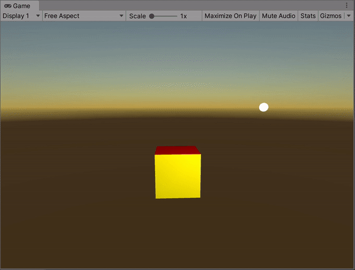
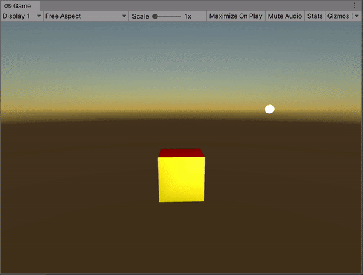
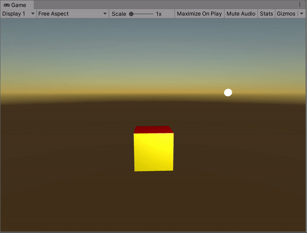
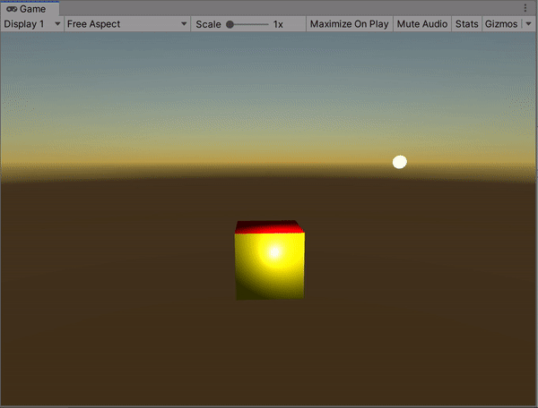
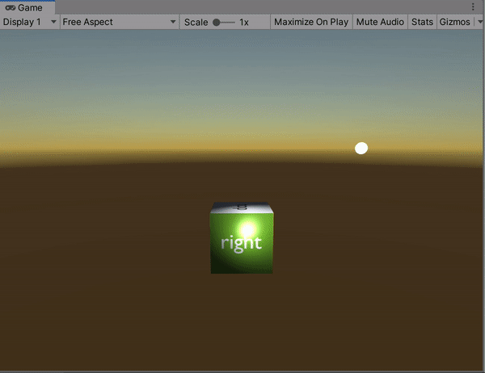

**The University of Melbourne**
# COMP30019 – Graphics and Interaction

## Workshop 8

# Introduction:

In this workshop you will be investigating the _Phong illumination model_ implemented via 
a custom Cg/HLSL shader in Unity. You will also be implementing different shading models
by considering at which stage in the rendering pipeline illumination is computed.

You will need to work with these files to start off with:
* **MainScene.unity** – The scene you'll need to open and modify, as usual.
* **GenerateCube.cs** – The same cube mesh generator from previous workshops, with some
  added _normals_.
* **PointLight.cs** – A simple "data structure" representing a point light source.
* **GouraudShader.shader** – A Cg/HLSL shader implementing the Phong illumination 
  model at each vertex (Gouraud shading). It isn't yet correct, but it's close!

### Tasks:

#### 1. Define the face normals

Clone/open the project in Unity, and enter play mode as usual. Notice that the cube drawn is not 
illuminated (only the ambient component is visible). This is because the surface normals 
haven’t been properly defined yet. Open `GenerateCube.cs` and modify the relevant data structure
such that correct surface normals are being used for all faces.

  

#### 2. Add some shine!

Now open `GouraudShader.shader` and examine the code (read the comments also
as there is a fair bit of context provided). 
To keep things consistent, 
we've generally used variable names for parameters in the shader which
correspond to the Phong illumination model equation. Notice that some of these are simply
set to `1`, e.g., `Ka`, `Kd`, `Ks`. In reality these would be tuned to model different
types of lighting conditions/surface properties, but at this point we're keeping it simple and
focusing on the core lighting computations. 

Take particular note of the fact that lighting calculations are performed in world space.
In order to do this, we simply utilise the model matrix (`unity_ObjectToWorld`) to convert
local model coordinates to world coordinates. This does not devoid the need for _also_ computing the
full `MVP` transform and passing it to the `SV_POSITION` output variable, as we still want to
render the object correctly. However this is a practical example of where computing partial `MVP`
products to solve problems in other coordinate systems is important. 

Notice that specular reflection currently isn't being implemented. (Why not?) Sketch out how you would 
perform the missing calculation to finish implementing specular reflection. Additionally,
read up (e.g. on Wikipedia) on the Blinn-Phong illumination model, which gives an alternative solution
to this problem.

> **Note**  
> Think back to some of the work you did when implementing reflection in your ray tracer! 
> While the overall means of illumination is distinctly different in ray tracing as opposed to
> rasterising, some of the core vector maths is identical.

  

#### 3. Phong illumination _and_ shading

Notice that the "specular highlight" effect looks a little strange at some points 
of the cube's rotation. Navigate around the scene and try to "maximise" the amount of
reflection you can see. From certain angles, e.g., reflection off the top of the
cube, there are very noticeable artefacts. This is because illumination is being computed on
a per-vertex basis, and calculated _colour_ values are being interpolated across the triangle
surfaces. Interpolated colours inside triangles are crude approximations for illumination.
This issue is particularly problematic with the cube since there are really only eight vertices
with which _unique_ illumination computations are being performed.

To address this we can instead compute illumination at the pixel/fragment shader stage, and use
interpolated world-space position/normal information. In other words, we'll still compute 
world space positions/normals at the
vertex shader stage, but defer the actual illumination model calculation until the pixel shader.
This means lighting is recomputed _per-pixel_ across the object surface. This is known as Phong shading.

Write a new shader called `PhongShader.shader` which uses Phong shading instead of Gouraud shading. 
The key challenge here will be modifying the `vertOut` structure appropriately such that world space
information is retained for use in the pixel/fragment shader later in the rendering pipeline. Note 
that `SV_POSITION` **must** remain the `MVP`-transformed normalised screen vertex position, 
however, you are free to add other variables
with different semantics! Feel free to use `TEXCOORD0`, `TEXCOORD1`,
`TEXCOORD2`, etc for arbitrary data semantics, even if not UV coordinates (this is an old convention
in Cg/HLSL shader programming). 

  

#### 4. "Smooth" the cube

Normals are obviously incredibly important for modeling how surfaces interact with light. If you look at
how they are currently defined in `GenerateCube.cs`, every vertex that is part of the same triangle has the same
normal. This leads to a "flat" appearance for each triangle. For a cube, it makes a lot of sense to
define them this way. However, let's suppose we wanted the cube to be "sphere-like" in terms of how
it is lit. This is not physically realistic -- but it's possible!

Your next task is to modify the cube normals, such that vertices at the same point
have the same ("averaged") normal, even if they belong to different faces of the cube. This
is not a shader exercise, but rather, requires you to modify the mesh
itself in `GenerateCube.cs`. Once complete, the cube will be lit as though it is "smooth" as seen in the below image.

  

#### 5. Add in some textures (challenge)

Revisit the first shader workshop where you explored UV coordinates and textures in an unlit setting.
To consolidate your understanding of the various techniques you have learned so far, integrate 
the texture capacities of the "texture" shader into the Phong shader from this workshop. In other
words, textures are used instead of vertex colours. You will not only need to modify the
shader, but also copy the `GenerateCube.cs` UV-coordinate definitions and 
respective `.png` image from the previous workshop.

  

#### 6. Integrate Unity engine lights (challenge)

If you have explored lighting in the Unity engine generally, you'll probably know there
are [built-in Unity lights](https://docs.unity3d.com/Manual/class-Light.html).
The `Light` component in Unity is not as distinct from the custom provided `PointLight.cs` class as 
you might think. Ultimately it also serves as a glorified "data structure" that represents light information.
It turns out shaders are automatically provided access to them, similar to `UNITY_MATRIX_MVP`.
Revisit [this page](https://docs.unity3d.com/Manual/SL-UnityShaderVariables.html), and bookmark 
it if you haven't already! Before continuing, make sure you have a read of the lighting
section on that page, so you are aware of the uniform variables that are available

Extend the Phong shader from this workshop to incorporate Unity lights instead of light data passed from
the `PointLight.cs` script. Handling all variations of Unity light configurations from the start
is going to be quite complex, so to begin, integrate a **single** Unity light source/type. If you want an
additional challenge from here, consider more complex configurations involving multiple 
light sources. It's worth reading up about [rendering paths](https://docs.unity3d.com/Manual/RenderingPaths.html) that
the built-in Unity rendering pipeline uses, and doing some research online more generally.

  

#### 7. Where to go from here... 

Well done, you've survived the shader programming workshops! You should have a solid understanding of the key concepts
behind vertex and pixel shaders, as well as the broader context (e.g. the "simplified" rendering pipeline). Still, despite a 
lot of class time dedicated to shaders, you've only seen the tip of the iceberg of what can be achieved with them. 
In order to further develop your understanding, here are some research/extension/challenge exercises 
you may wish to attempt in your own time:

- Try integrating the Phong illumination model with the wave vertex shader from last week so the waves are lit! Conversely,
  have a go at deforming the cube mesh today via a vertex shader, whilst keeping the Phong illumination model in place.
- Add calculations for the `fAtt` variable in the Phong illumination shader. 
- Try implementing a very simple fog effect. This borrows concepts from the computation of `fAtt`, but is relative to the
  camera instead.
- Research "normal mapping" and how it is used to add more lighting detail to the surface of objects.
- Have a go at implementing a stylistic illumination model, such as Cartoon/Cel shading.
- Research how _transparency_ may be implemented in Unity
  shaders, and the complexity that arises as a result of "overlapping" transparent objects.
- Read up about [blending modes](https://docs.unity3d.com/Manual/SL-Blend.html) available in Unity's shader lab.
  These are critical to achieving transparency, but also a whole host of other interesting effects.
- Investigate physically based rendering (PBR), and how it differs from Phong illumination. There's no need
  to implement it yourself as it'll be very complex, but it's important to understand how more modern lighting
  techniques are implemented at a conceptual level. (Note that the Unity standard shader is a PBR shader.)

The next workshops will be dedicated to game development concepts to assist with your work in the second
project. There will also be some general consultation time for the project. Remember to make 
a start on it if you haven't already -- it's a big one! As always, let us know if you have any questions on Ed.
